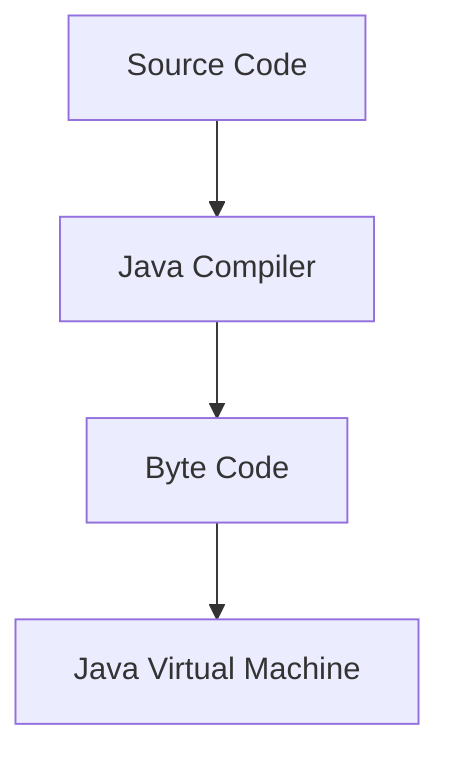

1. **Overview:**
	- **Platform-Independent Language:** Java is designed to be platform-independent, meaning that Java programs can run on any device that has the Java Virtual Machine (JVM).
2. **Key Components:**
	- **Java Development Kit (JDK):**
		- Includes the Java Compiler (javac) for compiling source code.
		- Contains the Java Runtime Environment (JRE) for running Java applications.
	- **Java Runtime Environment(JRE):**
		- JRE takes our Java code, integrates it with the required libraries, and then starts the JVM to execute it. To learn more about the Java Runtime Environment
	- **Java Virtual Machine (JVM):**
		- Interprets and executes Java bytecode.
		- Provides the abstraction between compiled Java code and the underlying hardware.
3. **Compilation Process:**
	- Java source code (.java files) is compiled into bytecode (.class files) by the Java Compiler.
	- Bytecode is platform-independent and can be executed on any device with a compatible JVM.
4. **Class Loader:**
	- **Loading Classes:** Responsible for loading classes into the JVM during runtime.
	- **Bootstrap Class Loader:** Loads core Java libraries.
	- **Extension Class Loader:** Loads classes from the extensions directory.
	- **System Class Loader:** Loads classes from the application classpath.
5. **Execution Engine:
	- **Interpreter:** Interprets bytecode line by line and executes it.
	- **Just-In-Time (JIT) Compiler:** Translates bytecode into native machine code for improved performance.
6. **Runtime Data Areas:
	- **Method Area:** Stores class structures, method and field data.
	- **Heap:** Memory for object instances and arrays.
	- **Stack:** Contains method-specific data and references.
	- **Program Counter (PC) Register:** Keeps track of the current instruction being executed.
7. **Garbage Collection:
	- **Automatic Memory Management:** JVM automatically reclaims memory occupied by objects that are no longer in use.
	- **Prevents Memory Leaks:** Enhances robustness and stability of Java applications.
8. **Java Native Interface (JNI):
	- Enables Java code to interact with applications and libraries written in other languages (e.g., C, C++).
9. **Security Manager:
	- Implements security policies to control the actions of untrusted Java applications.
10. **Java API (Application Programming Interface):
	- A rich set of libraries and frameworks for various functionalities like networking, I/O, databases, and more.
11. **Write Once, Run Anywhere (WORA):**
	- Reflects Java's philosophy of portability, allowing developers to write code once and run it on any device with a compatible JVM.

### Architecture Diagram
Refer  [[Types of Code]] for details 

```
            +-----------------------------------+
            |            Java Application       |
            | +-------------------------------+ |
            | |          Java Source Code     | |
            | |                               | |
            | +---------------+---------------+ |
            +-----------------|-----------------+
                              |
            +-----------------v-----------------+
            |        Java Compiler (javac)      |
            | +-------------------------------+ |
            | |        Bytecode (.class)      | |
            | +-------------------------------+ |
            +-----------------|-----------------+
                              |
            +-----------------v-----------------+
            |      Java Virtual Machine (JVM)   |
            | +-------------------------------+ |
            | |     Class Loader              | |
            | | +---------------------------+ | |
            | | |  Bootstrap Class Loader   | | |
            | | |  Extension Class Loader   | | |
            | | |  System Class Loader      | | |
            | | +---------------------------+ | |
            | |     Execution Engine          | |
            | | +---------------------------+ | |
            | | |   Interpreter             | | |
            | | |   Just-In-Time (JIT)      | | |
            | | +---------------------------+ | |
            | |     Runtime Data Areas        | |
            | | +---------------------------+ | |
            | | |  Method Area              | | |
            | | |  Heap                     | | |
            | | |  Stack                    | | |
            | | |  Program Counter Register | | |
            | | +---------------------------+ | |
            | |     Garbage Collection        | |
            | |     Java Native Interface     | |
            | |     Security Manager          | |
            | +-------------------------------+ |
            +-----------------|-----------------+
                              |
            +-----------------v-----------------+
            |       Java API (Libraries)        |
            +-----------------------------------+

```

#### Simple graphical representation of java architecture



## Sample Program

Lets start with **C** program 

```C
// save this in hello.c file

#include <stdio.h>
#include <conio.h>

int main(){
    printf("Hello from C program!!!");
    getch();
    return 0;
}
```

To compile use following command 

```bash 
gcc hello.c -o hello
```

Now based of operating system you will have different files after compilation. In Windows you will get `hello.exe` file and in Linux `hello.o`. These files are object code so can be executed as follows 

```bash 
./hello
```

Now lets get equivalent result from Java
```Java
// save as file Hello.java 

public class Hello{
	public static void main(){
		System.out.println("Hello from Java program!!!");
	}
}
```


"Write Once, Run Anywhere" (WORA) is a phrase