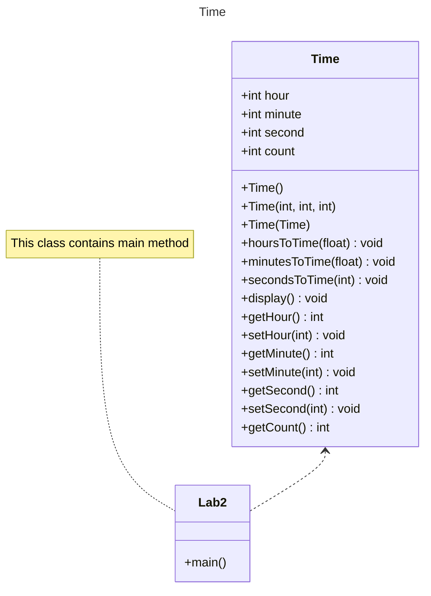

## OBJECTIVES
 - Understand the different types of constructors 
 - Understand the reference type and value type
 - Use Access Specifiers to limit the scope of member attributes and methods
 - Get familiar with Getter and Setters
 - Exception Handling

### Constructors
1. Write a program to demonstrate that default constructor is created by compiler if no constructors are explicitly defined.
2. Write a program to test default constructor is not  created automatically if any other constructor is defined explicitly
3. Write a program to demonstrate the use of all types of constructors.
```java
// filename: Application.java
class Person{
    protected String name;
    protected int age;
    
    public Person(){
        this.name = "Unknown";
        this.age = 0;
    }
    
    public Person(String name, int age){
        this.name = name;
        this.age = age;
    }
    
    public void display(){
        System.out.println("Name: " + this.name);
        System.out.println("Age: " + this.age);
    }
}

class Student extends Person{
    private int roll;

    public Student(){
        super(); //accessing parent default constructor
        this.name = "Unknown";
    }

    public Student(int roll){
	    super();
        this.roll = roll;
    }

    public Student(String name, int age, int roll){
        super(name, age);
        this.roll = roll;
    }

    public void display(){
        super.display();
        System.out.println("Roll: " + this.roll);
    }
}


public class Application {

    public static void main(String[] args) {
        Student s1 = new Student(5);
        s1.display();
        
        Student s2 = new Student("Ram", 20, 10);
        s2.display();
    }

}
```
### Reference type
1. Write a program to with copy constructor and demonstrate different behavior's of reference type
### Access Specifier, getter and setter
1. Write a sample program to demonstrate the use of access specifier and how getter and setter helps to access the private attributes
### Exception Handling
1. Write a program to demonstrate the use of exception handling
```java 
public class ExceptionHandlingExample {

    public static void main(String[] args) {
        try {
            // Code that may throw an exception
            int result = divideNumbers(10, 0);
            System.out.println("Result: " + result);
        } catch (ArithmeticException e) {
            // Catching and handling the ArithmeticException
            System.out.println("Error: Division by zero is not allowed.");
            e.printStackTrace();
        } finally {
            // Code inside the finally block will be executed regardless of whether an exception occurs
            System.out.println("Finally block executed.");
        }

        // Rest of the program continues execution
        System.out.println("Program continues after exception handling.");
    }

    // A method that performs division and may throw an ArithmeticException
    private static int divideNumbers(int numerator, int denominator) {
        return numerator / denominator;
    }
}
```

Significance of finally block 
```java 
import java.io.FileWriter;
import java.io.IOException;

public class FinallyExample {

    public static void main(String[] args) {
        FileWriter fileWriter = null;

        try {
            fileWriter = new FileWriter("example.txt");
            fileWriter.write("Hello, World!");
            // Simulating an exception
            int result = 10 / 0;
        } catch (IOException e) {
            e.printStackTrace();
        } catch (ArithmeticException e) {
            e.printStackTrace();
        } finally {
            // Cleanup code to close the FileWriter
            if (fileWriter != null) {
                try {
                    fileWriter.close();
                } catch (IOException e) {
                    e.printStackTrace();
                }
            }
            System.out.println("Finally block executed.");
        }
    }
}
```

### Homework 
Write a Class Time with attributes hour, minute and second. The class should provide following methods 
1. Write all types of constructors i.e. default, parameterized and copy constructor
2. hoursToTime: convert float hour value to hour, minute and second (nearest)
3. minutesToTime: convert float minute value to hour, minute and second (nearest)
4. secondsToTime: convert integer seconds value to hour, minute and second
5. addSecondsToTime: it should add given seconds to the existing time
6. Write getter and setter for all member attributes. The setters should not accept negative values and must throw user defined exception e.g.```InvalidValueException``` 
7. display: to display time in HH:MM:SS format 
In addition to above functionality add one private static integer member attribute with only getter(no setter) which should maintain the total number of Time objects created and Print this at the end of Program. 

	#### Class Diagram



Sample main method should look as below 
```java 
public class Lab2{
	public static void main(String[] args){
		//demonstrating use of default constructor and settors
		Time t1 = new Time();
		t1.setHour(15);
		t1.setMinute(5);
		t1.setSecond(7);
		t1.display();
		//demonstrating parameterized constructor
		Time t2 = new Time(15,5,7);
		t2.display();
		// demonstrating copy constructor
		Time t3 = new Time(t1);
		t3.addSecondsToTime(53);
		t3.display();
		
		// generating exception
		try{
			t3.setSeconds(-5);
		}catch(InvalidValueException e){
			System.out.println(e.getMessage());
		}finally{
			System.out.println("Finally called");
		}

		Time t4 = new Time();
		t4.hoursToTime(5.87);
		t4.display();
		
		Time t5 = new Time();
		t5.minutesToTime(100.5)
		t5.display();
		
		Time t6 = new Time();
		t6.secondsToTime(500);
		t6.display();

		Sustem.out.println("Total number of Time object created: "+ Time.getCount() )
	}
}
```

