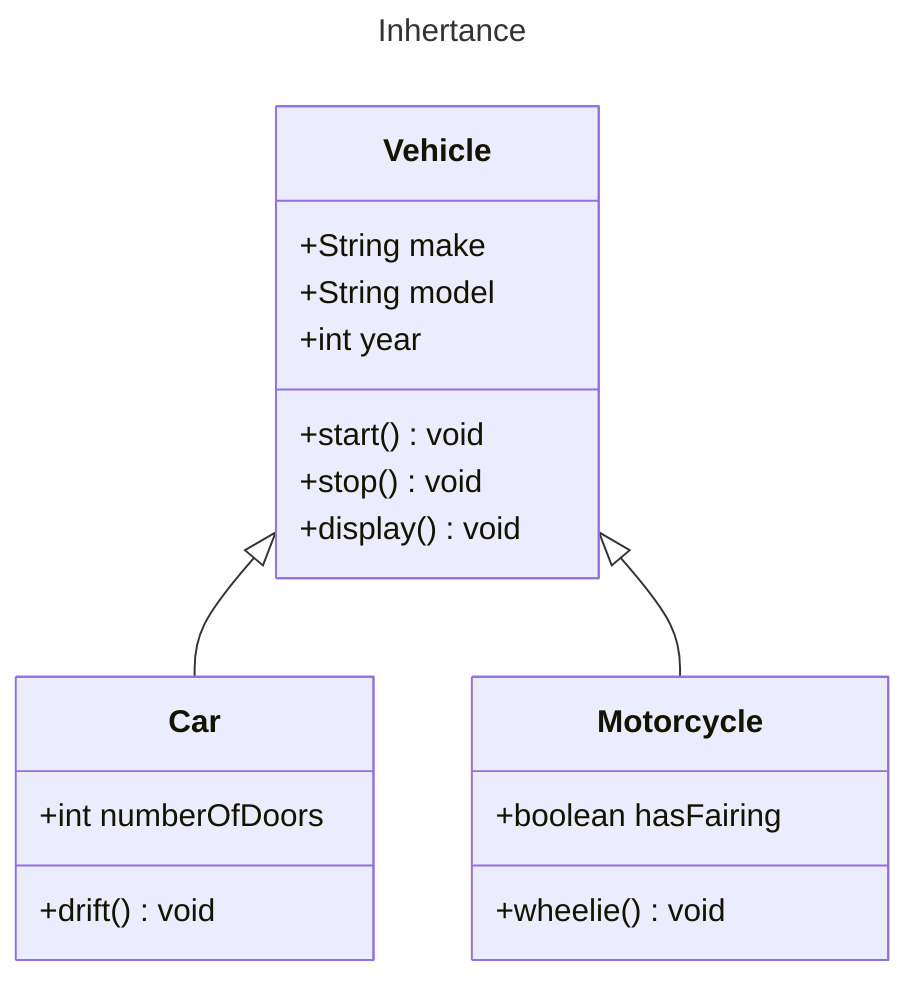

## OBJECTIVES
- Understanding parent class and child class (Inheritance)
- Member access using super keyword
- Differentiating Overriding and Overloading
- Experimenting the effect of access specifier in inheritance 
- Final classes and methods

### Programs
1. Write a program to implement following 


```java 
class Vehicle {
    protected String make; // experiment by making these attributes private
    protected String model;
    protected int year;

    // Constructors, getters, setters, and other common vehicle-related methods

    public void start() {
        System.out.println("Vehicle is starting.");
    }

    public void stop() {
        System.out.println("Vehicle is stopping.");
    }
    
    public void display(){
	    //write statements to display member attributes 
    }

}

class Car extends Vehicle {
    private int numberOfDoors;

    // Constructors, getters, setters, and specific car-related methods

    @Override
    public void start() {
        System.out.println("Car is starting.");
        // Additional car-specific startup logic
    }

    @Override
    public void stop() {
        System.out.println("Car is stopping.");
        // Additional car-specific shutdown logic
    }

	@Override
    public void display() {
        // access parent display using super
        // print additional member attributes 
    }

    public void drift() {
        System.out.println("Car is drifting.");
        // Additional car-specific drifting logic
    }
}

class Motorcycle extends Vehicle {
    private boolean hasFairing;

    // Constructors, getters, setters, and specific motorcycle-related methods

    @Override
    public void start() {
        System.out.println("Motorcycle is starting.");
        // Additional motorcycle-specific startup logic
    }

    @Override
    public void stop() {
        System.out.println("Motorcycle is stopping.");
        // Additional motorcycle-specific shutdown logic
    }

    public void wheelie() {
        System.out.println("Motorcycle is doing a wheelie.");
        // Additional motorcycle-specific wheelie logic
    }
}
```
2. Try accessing ```start``` and ```stop``` of parent class from child class using ```super```
3. Note that ```start``` and ```stop``` functions are overriden in child class but to demonstrate overload write constructors
4. Change protected members of vehicle to private and see the results.
5. Change above program to convert Vehicle class to final and test what happens. Similarly convert member methods of vehicle to final and test the results.
### Homework 
Write a program for following narrative along with main method to make use of all functions. 

In our banking system, we have a robust class hierarchy designed to model the various types of accounts that our customers can hold. At the top of this hierarchy is the `BankAccount` class, which encapsulates the fundamental attributes and behaviors shared by all accounts.

The `BankAccount` class includes essential details such as the account number, account holder information, and the current balance. It also provides common transaction methods like `deposit`, `withdraw`, and `displayBalance`. This base class ensures consistency and facilitates code reuse across different account types.

Now, let's delve into two specific types of accounts that inherit from the `BankAccount` class: `SavingsAccount` and `CheckingAccount`.

The `SavingsAccount` class extends the functionality of a general bank account to incorporate features unique to savings accounts. It introduces an `interestRate` attribute to represent the interest rate associated with the account. Additionally, a specialized method, `addInterest`, calculates and adds interest to the account balance based on the interest rate.

On the other hand, the `CheckingAccount` class represents a checking account, which often comes with overdraft protection. It introduces an `overdraftLimit` attribute to specify the maximum negative balance allowed. To ensure prudent financial management, the `withdraw` method is overridden in this class to include logic for overdraft protection, preventing transactions that exceed the overdraft limit.

This inheritance hierarchy not only captures the shared characteristics of all bank accounts but also provides a structured framework for accommodating the specific attributes and behaviors of savings and checking accounts. By leveraging inheritance, we promote code organization, maintainability, and reusability, enabling our banking system to effectively manage the diverse needs of our customers.

NOTE: Lab report needs to include proper class diagram for above narrative.

